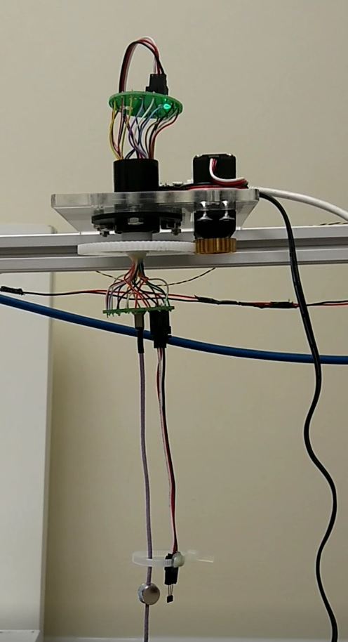
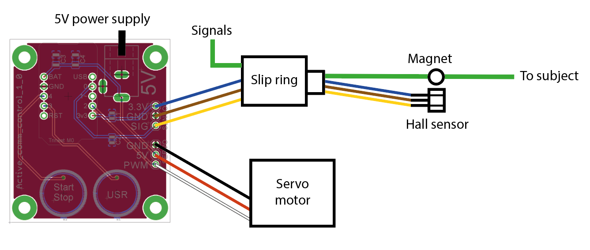

# Active commutator

A simple open source active commutator for Open Ephys / Intan electrophysiology systems.  Uses a hall sensor and magnet to detect rotation of the cable,  a slip ring powered by a continuous rotation servo to correct it, controlled by an Adafruit Trinket M0  running Circuitpython. 

Inspired by earlier designs from [Liberti et al. 2017](https://iopscience.iop.org/article/10.1088/1741-2552/aa6806/meta) and [Fee and Leonardo 2001](https://www.sciencedirect.com/science/article/pii/S0165027001004265).

## Wiring diagram

